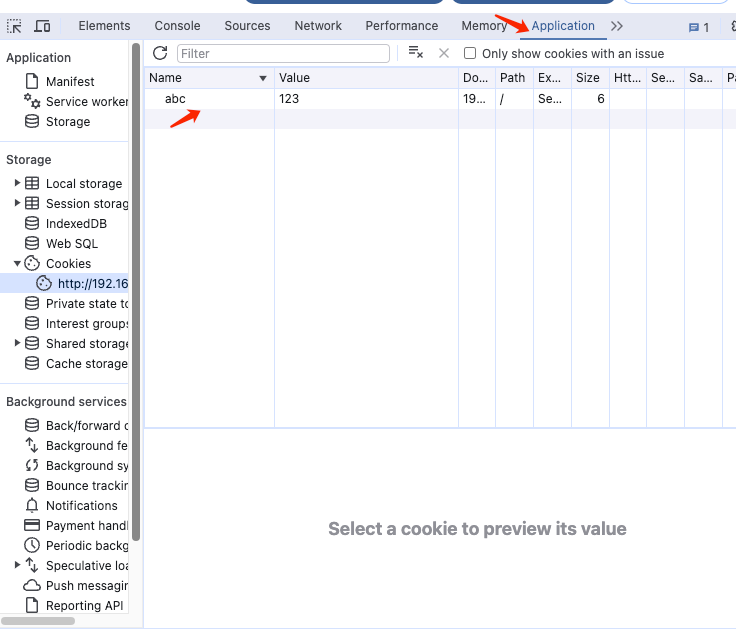
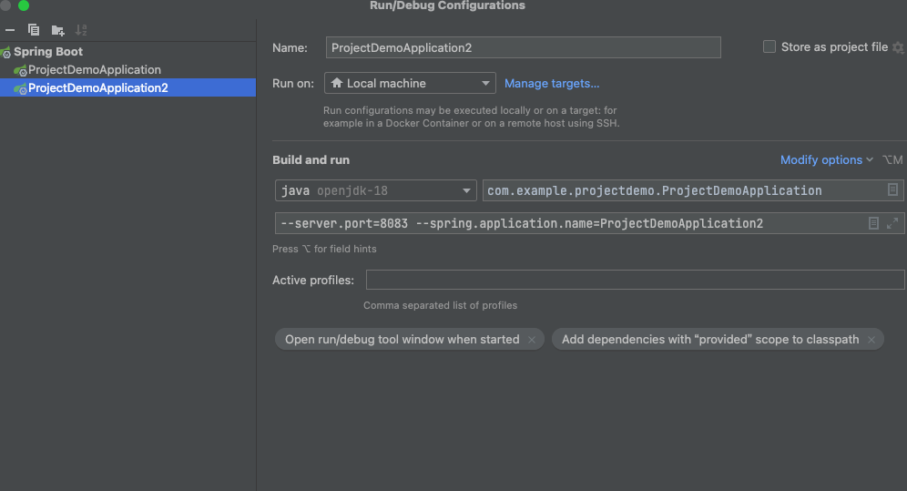

b站【尚学堂】SpringCloud Gateway微服务网关视频教程 跟练 
原视频地址https://www.bilibili.com/video/BV1JB4y1F7aL?p=1&vd_source=e93efa15b0866358118f5e680319bb7e

**环境：openjdk-18**
另外两个项目的地址
https://github.com/sugar-orange666/ProjectDemo
https://github.com/sugar-orange666/EurekaServer

**启动顺序**
1. 先启动EurekaServer 可以访问 http://localhost:8761/
2. 启动projectDemo 可以访问 http://localhost:8080/one
3. 启动GatewayDemo  可以访问 http://localhost:9000/demo/one

4. 可以访问 http://localhost:9000/demo/one?name=%22%E5%B0%8F%22&age=1

**注意事项：**
1. RemoteAddr 和Host都不要用127.0.0.1 用局域网的ip
2. 测试的时候cookie 可以在chrome f12 Application Cookie中新增name abc value124(也可postman请求)
   
3. 测试权重，ProjectDemo需要新建一个configuration,如下：

4. 测试限流的时候，jmeter报错了，java.net.SocketException: Connection reset xxx 把ip地址localhost换成局域网ip就可以了
